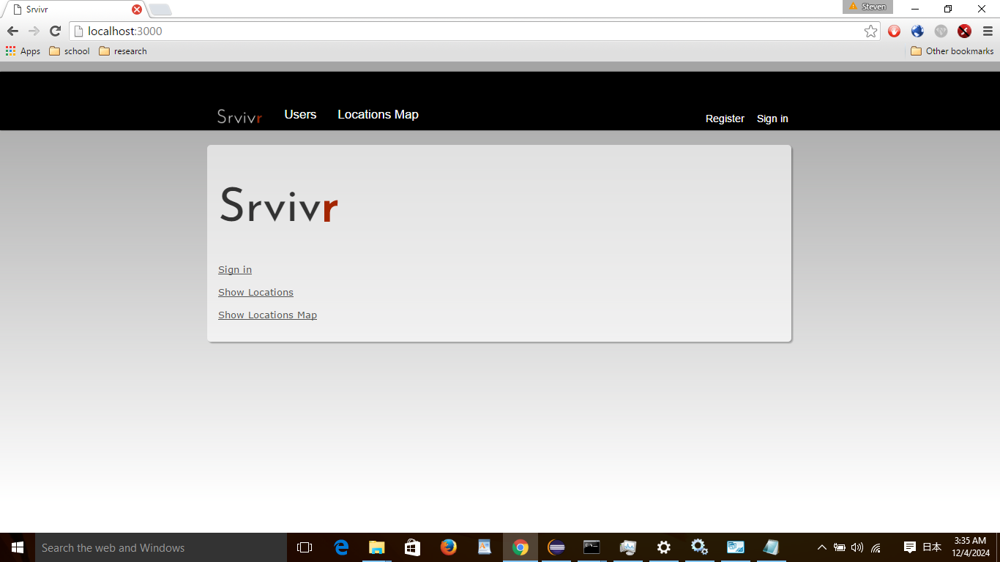
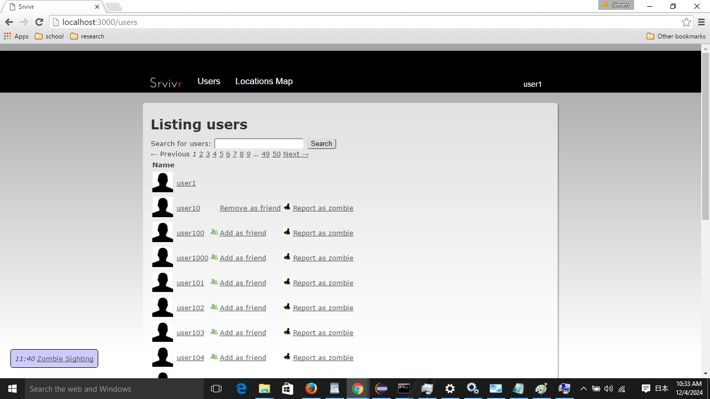
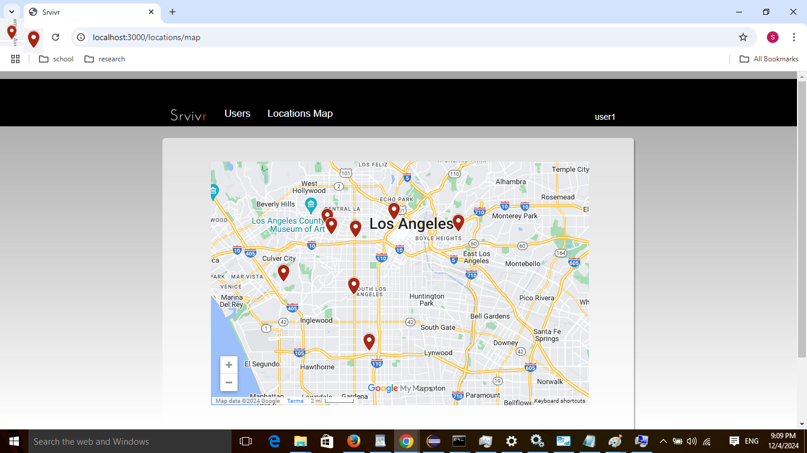

Srvivr is a social networking website that incorporates elements from media sources. It's design goals were to learn how to write and test a themed website, and to optimize its performance and make it scalable.

Written by Bo Lopker, Christopher Hall, Ian Whitfield, Ken O. Grønnbeck, Severin Sverdvik, Steven Bluen, and Xun Tang.

My contributions were in the users, friend adding, sessions, site security filters, and initial seeds for demonstrations.

The website initializes to look like these pictures:

